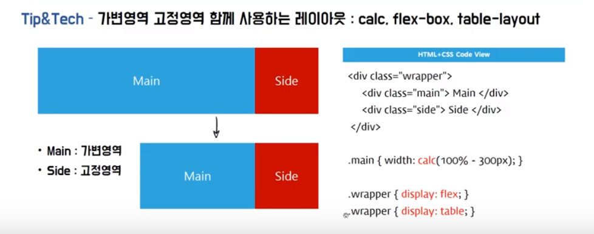
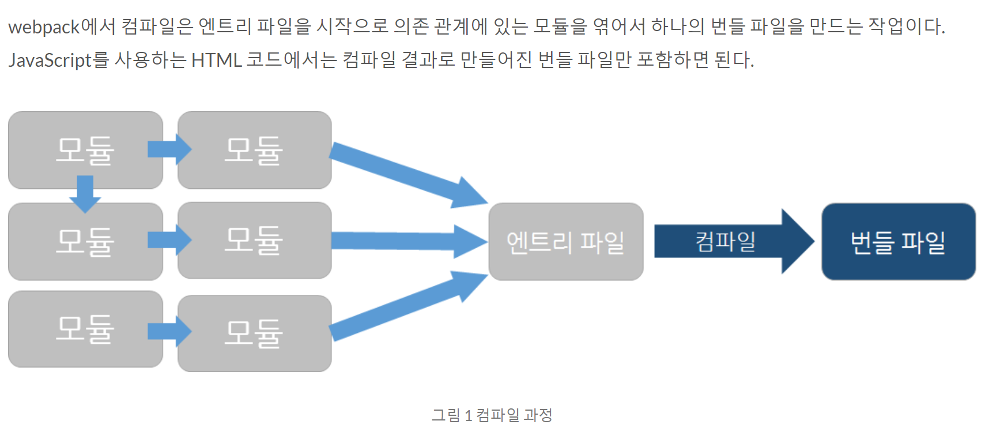

# JavaScript-Study
* JavaScript study
* Code Review study

# 1. Promise()

* 동기적 호출 : 순서대로 실행
* 비동기적 호출 : 코드읽을 때 순서를 헷갈릴 수 있음
* promise는 then()으로 콜백을 연결한다. then()은 promise(resolve, reject)를 return함.
* 연결된 다음 then() 콜백함수가 실행되었다는 것은 앞의 리턴된 프로미스가 resolve가 되었다는 뜻!
* **비동기적 프로세스를 동기적 프로세스로 변환시킨다.**
---------------------
* 동기적 및 비동기적 호출 : https://www.youtube.com/watch?v=j0Viy3v97gY
* Promise() : https://www.youtube.com/watch?v=CA5EDD4Hjz4

# 2. 가변영역 고정영역 함께 사용하는 레이아웃

<p align="center">
	
</p>

## 1) calc() : https://developer.mozilla.org/ko/docs/Web/CSS/calc
* 가변영역에 calc() 적용

```css
.main {
  width: calc(100% - 300px);
}
```

* 가로배치

```css
.main, .side {
  float: left;
}
```

## 1-1) Vendor prefix : Cross Browsing
* chrome : -webkit-
* firefox : -moz-
* opera : -o-
* IE : -ms-

## 2) table-layout
* 부모 영역

```css
.wrapper {
  display: table;
  width: 100%
}
```

* 자식 영역

```css
.main, .side {
  display: table-cell
}
```

## 3) flex-box
* 부모영역

```css
.wrapper {
  display: flex;
}
```
---------------------
* 가변영역 고정영역 함께 사용하는 레이아웃(calc, flex, display) : https://www.youtube.com/watch?v=RthnACwgqr8

# 3. Object Type

* 자바스크립트의 객체 개념은 생성 방법이나 상속 방식 등에서 C++이나 자바와 같은 기존 객체지향 언어에서의 객체 개념과는 약간 다르다. 자바에서는 클래스를 정의하고, 클래스의 인스턴스를 생성하는 과정에서 객체가 만들어진다. 이에 비해 자바스크립트에서는 **클래스라는 개념이 없고, 객체 리터럴이나 생성자 함수** 등 **별도의 생성 방식**이 존재한다.

## 1) [Object() 생성자 함수](https://developer.mozilla.org/ko/docs/Web/JavaScript/Reference/Global_Objects/Object)

```javascript
//  Object()사용하여 빈 객체 생성
var foo = new Object();

//  foo 객체 프로퍼티 생성
foo.name = 'name'
foo.age = 30
foo.gender = 'male'

console.log(type of foo) // object
console.log(foo)  //  { name: 'name', age: 30, gender: 'male' }
```

## 2) 객체 리터럴 방식

* 리터럴이란 객체를 생성하는 표기법

```javascript
//  객체 리터럴 방식으로 빈 객체 생성
var foo = {
  name: 'name',
  age: 30,
  gender: 'male'
}

//  foo 객체 프로퍼티 생성
foo.name = 'name'
foo.age = 30
foo.gender = 'male'

console.log(type of foo) // object
console.log(foo)  //  { name: 'name', age: 30, gender: 'male' }
```

## 3) 생성자 함수 이용

* 함수도 객체다.
* 자바스크립트에서는 함수를 **일급 객체(First Class)** 라고 부른다.

```javascript
//  함수 선언 방식으로 add() 함수 정의
function add(x, y) {
  return x + y
}

//  add() 함수 객체에 result, status 프로퍼티 추가
add.result = add(3,2)
add.status = 'ok'

console.log(add.result) //  5
console.log(add.status)  // 'ok'
```

## 4) [Object.assign()](https://developer.mozilla.org/ko/docs/Web/JavaScript/Reference/Global_Objects/Object/assign)

* copy : copy.a는 **읽기 전용** 속성

```javascript
const obj = { a: 1 };
const copy = Object.assign({}, obj);
console.log(copy); // { a: 1 }
```

* merge : 속성은 파라미터 순서에서 더 뒤에 위치한 동일한 속성을 가진 다른 객체에 의해 덮어쓰임

```javascript
const o1 = { a: 1 };
const o2 = { b: 2 };
const o3 = { c: 3 };

const obj = Object.assign(o1, o2, o3);
console.log(obj); // { a: 1, b: 2, c: 3 }
console.log(o1);  // { a: 1, b: 2, c: 3 } 대상 객체 자체가 변경됨.
```

## 5) [Object.keys()](https://developer.mozilla.org/ko/docs/Web/JavaScript/Reference/Global_Objects/Object/keys)

* 메서드는 개체 고유 속성의 이름을 배열로 반환

```javascript
const object1 = {
  a: 'somestring',
  b: 42,
  c: false
};

console.log(Object.keys(object1));
// expected output: Array ["a", "b", "c"]
```

* 비열거형(non-enumerables)을 포함한 모든 객체를 원한다면 [Object.getOwnPropertyNames()](https://developer.mozilla.org/ko/docs/Web/JavaScript/Reference/Global_Objects/Object/getOwnPropertyNames)를 참고

## 6) [Object.entries()](https://developer.mozilla.org/ko/docs/Web/JavaScript/Reference/Global_Objects/Object/entries)

* **enumerable 속성** [key, value] 쌍의 배열을 반환

```javascript
var params = {
  id: this.Id,
  startDate: this.startDate,
  endDate: this.endDate
}

params = Object.entries(params).map((param) => {
  return param.join('=')
}).join('&')
console.log(params) //  id=testId&startDate=02-01&endDate=02-03
```

* Converting an Object to **a Map**

```javascript
const obj = { first: 'hi', second: 25 }; 
const map = new Map(Object.entries(obj));
console.log(map); // Map { first: "hi", second: 25 }
```

* array 구조를 사용하여 **객체를 쉽게 반복** 가능

```javascript
const obj = { first: 'hi', second: 25 };
Object.entries(obj).forEach(([key, value]) => console.log(`${key}: ${value}`)); // "first: hi", "second: 25"
```

# 4. Function

## 1) arguments 객체

* 매개변수 개수가 정확하게 정해지지 않은 함수를 구현하거나, 전달된 인자의 개수에 따라 서로 다른 처리를 해줘야 하는 함수에 유용

```javascript
function sum() {
  var result = 0
  
  for (var i = 0; i < arguments.length; i++){
    result += arguments[i]
  }
  return result
}

console.log(sum(1, 2, 3)) //  6
console.log(sum(1, 2, 3, 4, 5, 6, 7, 8, 9, 10)) //  45
```

*  arguments는 **유사배열**이므로 **배열 메서드 사용불가**

```javascript
argFunction(dynamicData)

//  arguments는 유사배열이므로 배열 메서드 사용불가 -> call() 활용
function argFunction() {
    [].forEach.call(arguments, function(el) {
        console.log(el)
    })
}

```

# 5. [unset - CSS](https://developer.mozilla.org/en-US/docs/Web/CSS/unset)

* html

```html
<p>This text is red</p>
<div id="sidebar">
  <p>This text has the default color</p>
</div>
```

* css

```css
p {
  color: red;
}

#sidebar p {
  color: unset;
}

```

# 6. [minChunks - WebPack](https://webpack.js.org/plugins/commons-chunk-plugin/#explicit-vendor-chunk)

```javascript
module.exports = {
  //...
  entry: {
    vendor: ['jquery', 'other-lib'],
    app: './entry'
  },
  plugins: [
    new webpack.optimize.CommonsChunkPlugin({
      name: 'vendor',
      // filename: "vendor.js"
      // (Give the chunk a different name)

      minChunks: Infinity,
      // (with more entries, this ensures that no other module
      //  goes into the vendor chunk)
    })
  ]
};
```

# 7. [flexible Layout - CSS](https://naradesign.github.io/article/)

# 8. [WebPack](https://naradesign.github.io/article/)

* [webpack이란?](https://d2.naver.com/helloworld/0239818)

<p align="center">
	
</p>

* [웹펙 기본 사용법 (CLI)](https://www.daleseo.com/webpack-basics/)

* [웹펙 기본 설정(Entry/Output/Loader/Plugins)](https://www.daleseo.com/webpack-config/)

* [WebPack 영상](https://www.youtube.com/playlist?list=PLpkj8RKr48wY2RgNIvcnIWram82a0ZXa8)
