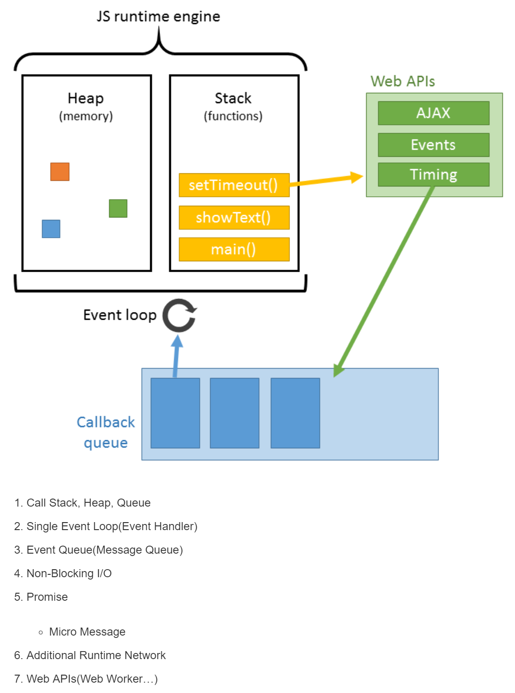

# JavaScript-Study
* JavaScript study
* Code Review study
* [CSS study](https://ko.learnlayout.com/toc.html)

-------------------------------------

# 1. Promise()

* 동기적 호출 : 순서대로 실행
* 비동기적 호출 : 코드읽을 때 순서를 헷갈릴 수 있음
* promise는 then()으로 콜백을 연결한다. then()은 promise(resolve, reject)를 return함.
* 연결된 다음 then() 콜백함수가 실행되었다는 것은 앞의 리턴된 프로미스가 resolve가 되었다는 뜻!
* **비동기적 프로세스를 동기적 프로세스로 변환시킨다.**
* [동기적 및 비동기적 호출](https://www.youtube.com/watch?v=j0Viy3v97gY)
* [Promise()](https://www.youtube.com/watch?v=CA5EDD4Hjz4)

# 2. 가변영역 고정영역 함께 사용하는 레이아웃

<p align="center">
	
</p>

## 1) [calc()](https://developer.mozilla.org/ko/docs/Web/CSS/calc)
* 가변영역에 calc() 적용

```css
.main {
  width: calc(100% - 300px);
}
```

* 가로배치

```css
.main, .side {
  float: left;
}
```

## 1-1) Vendor prefix : Cross Browsing
* chrome : -webkit-
* firefox : -moz-
* opera : -o-
* IE : -ms-

## 2) table-layout
* 부모 영역

```css
.wrapper {
  display: table;
  width: 100%
}
```

* 자식 영역

```css
.main, .side {
  display: table-cell
}
```

## 3) flex-box
* 부모영역

```css
.wrapper {
  display: flex;
}
```

* [가변영역 고정영역 함께 사용하는 레이아웃(calc, flex, display)](https://www.youtube.com/watch?v=RthnACwgqr8)

# 3. Object Type

* 자바스크립트의 객체 개념은 생성 방법이나 상속 방식 등에서 C++이나 자바와 같은 기존 객체지향 언어에서의 객체 개념과는 약간 다르다. 자바에서는 클래스를 정의하고, 클래스의 인스턴스를 생성하는 과정에서 객체가 만들어진다. 이에 비해 자바스크립트에서는 **클래스라는 개념이 없고, 객체 리터럴이나 생성자 함수** 등 **별도의 생성 방식**이 존재한다.

## 1) [Object() 생성자 함수](https://developer.mozilla.org/ko/docs/Web/JavaScript/Reference/Global_Objects/Object)

```javascript
//  Object()사용하여 빈 객체 생성
var foo = new Object();

//  foo 객체 프로퍼티 생성
foo.name = 'name'
foo.age = 30
foo.gender = 'male'

console.log(type of foo) // object
console.log(foo)  //  { name: 'name', age: 30, gender: 'male' }
```

## 2) 객체 리터럴 방식

* 리터럴이란 객체를 생성하는 표기법

```javascript
//  객체 리터럴 방식으로 빈 객체 생성
var foo = {
  name: 'name',
  age: 30,
  gender: 'male'
}

//  foo 객체 프로퍼티 생성
foo.name = 'name'
foo.age = 30
foo.gender = 'male'

console.log(type of foo) // object
console.log(foo)  //  { name: 'name', age: 30, gender: 'male' }
```

## 3) 생성자 함수 이용

* 함수도 객체다.
* 자바스크립트에서는 함수를 **일급 객체(First Class)** 라고 부른다.

```javascript
//  함수 선언 방식으로 add() 함수 정의
function add(x, y) {
  return x + y
}

//  add() 함수 객체에 result, status 프로퍼티 추가
add.result = add(3,2)
add.status = 'ok'

console.log(add.result) //  5
console.log(add.status)  // 'ok'
```

## 4) [Object.assign()](https://developer.mozilla.org/ko/docs/Web/JavaScript/Reference/Global_Objects/Object/assign)

* copy : copy.a는 **읽기 전용** 속성

```javascript
const obj = { a: 1 };
const copy = Object.assign({}, obj);
console.log(copy); // { a: 1 }
```

* merge : 속성은 파라미터 순서에서 더 뒤에 위치한 동일한 속성을 가진 다른 객체에 의해 덮어쓰임

```javascript
const o1 = { a: 1 };
const o2 = { b: 2 };
const o3 = { c: 3 };

const obj = Object.assign(o1, o2, o3);
console.log(obj); // { a: 1, b: 2, c: 3 }
console.log(o1);  // { a: 1, b: 2, c: 3 } 대상 객체 자체가 변경됨.
```

## 5) [Object.keys()](https://developer.mozilla.org/ko/docs/Web/JavaScript/Reference/Global_Objects/Object/keys)

* 메서드는 개체 고유 속성의 이름을 배열로 반환

```javascript
const object1 = {
  a: 'somestring',
  b: 42,
  c: false
};

console.log(Object.keys(object1));
// expected output: Array ["a", "b", "c"]
```

* 비열거형(non-enumerables)을 포함한 모든 객체를 원한다면 [Object.getOwnPropertyNames()](https://developer.mozilla.org/ko/docs/Web/JavaScript/Reference/Global_Objects/Object/getOwnPropertyNames)를 참고

## 6) [Object.entries()](https://developer.mozilla.org/ko/docs/Web/JavaScript/Reference/Global_Objects/Object/entries)

* **enumerable 속성** [key, value] 쌍의 배열을 반환

```javascript
var params = {
  id: this.Id,
  startDate: this.startDate,
  endDate: this.endDate
}

params = Object.entries(params).map((param) => {
  return param.join('=')
}).join('&')
console.log(params) //  id=testId&startDate=02-01&endDate=02-03
```

* Converting an Object to **a Map**

```javascript
const obj = { first: 'hi', second: 25 }; 
const map = new Map(Object.entries(obj));
console.log(map); // Map { first: "hi", second: 25 }
```

* array 구조를 사용하여 **객체를 쉽게 반복** 가능

```javascript
const obj = { first: 'hi', second: 25 };
Object.entries(obj).forEach(([key, value]) => console.log(`${key}: ${value}`)); // "first: hi", "second: 25"
```

# 4. Function

## 1) arguments 객체

* 매개변수 개수가 정확하게 정해지지 않은 함수를 구현하거나, 전달된 인자의 개수에 따라 서로 다른 처리를 해줘야 하는 함수에 유용

```javascript
function sum() {
  var result = 0
  
  for (var i = 0; i < arguments.length; i++){
    result += arguments[i]
  }
  return result
}

console.log(sum(1, 2, 3)) //  6
console.log(sum(1, 2, 3, 4, 5, 6, 7, 8, 9, 10)) //  45
```

*  arguments는 **유사배열**이므로 **배열 메서드 사용불가**

```javascript
argFunction(dynamicData)

//  arguments는 유사배열이므로 배열 메서드 사용불가 -> call() 활용
function argFunction() {
    [].forEach.call(arguments, function(el) {
        console.log(el)
    })
}

```

# 5. [unset - CSS](https://developer.mozilla.org/en-US/docs/Web/CSS/unset)

* html

```html
<p>This text is red</p>
<div id="sidebar">
  <p>This text has the default color</p>
</div>
```

* css

```css
p {
  color: red;
}

#sidebar p {
  color: unset;
}

```

# 6. [flexible Layout - CSS](https://naradesign.github.io/article/)

# 7. [Webpack](https://www.youtube.com/playlist?list=PLpkj8RKr48wY2RgNIvcnIWram82a0ZXa8)

## 1) [Webpack이란?](https://d2.naver.com/helloworld/0239818)

<p align="center">
	
</p>

### a. 사용 이유 & 배경
* 기존 Web Task Manager (Gulp, Grunt)의 기능 + 모듈 의존성 관리
* ex) minification을 webpack default cli로 실행 가능

```
$ webpack -p
```

### b. 자바스크립트 Code based Modules 관리

* 자바스크립트 **모듈화의 필요성** (파일베이스 모듈화x, 전역변수 등) : AMD, Common js, ES6(Modules)

* 문제점 : 전역변수 충돌, 스크립트 로딩 순서, 복잡도에 따른 관리상의 문제

```javascript
<script src="module1.js"></script>
<script src="module2.js"></script>
<script src="library1.js"></script>
<script src="module3.js"></script>
```

* 기본 모듈 로더들과의 차이점 : 모듈 간의 관계를 Chunk 단위로 나눠 필요할 때 로딩
* 현대의 웹에서 JS 역할이 커짐에 따라 , Client Side에 들어가는 코드량이 많아지고 복잡해짐
* 복잡한 웹읍 앱을 관리하기 위해 모듈 단위로 관리하는 Common js, AMD, ES6 Modules 등이 등장
* 가독성이나 다수 모듈 미병행 처리등의 약점 보완위해 Webpack 등장

### c. 철학
* **Everything is Module** : 모든 웹 자원(js, css, html)이 모듈 형태로 로딩가능

```javascript
require('base.css')
require('main.js')
```

* **Load only 'what' you need and 'when' you need** : 초기에 불필요한 것들을 모두 로딩하지 않고, 필요할 때 필요한 것만 로딩하여 사용

## 2) [웹펙 기본 사용법 (CLI)](https://www.daleseo.com/webpack-basics/)

## 3) [웹펙 기본 설정(Entry/Output/Loader/Plugins)](https://www.daleseo.com/webpack-config/)

### a. webpack.config.js

* [Getting Started : Webpack](https://www.youtube.com/watch?v=fcNAiMSlciI)
```javascript
// webpack.config.js
// `webpack` command will pick up this config setup by default
var path = require('path');

module.exports = {
  entry: './app/index.js',
  output: {
    filename: 'bundle.js',
    path: path.resolve(__dirname, 'dist')
  }
};
```

* [Tutorials](https://github.com/joshua1988/LearnWebpack)

### b. [minChunks](https://webpack.js.org/plugins/commons-chunk-plugin/#explicit-vendor-chunk)


```javascript
module.exports = {
  //...
  entry: {
    vendor: ['jquery', 'other-lib'],
    app: './entry'
  },
  plugins: [
    new webpack.optimize.CommonsChunkPlugin({
      name: 'vendor',
      // filename: "vendor.js"
      // (Give the chunk a different name)

      minChunks: Infinity,
      // (with more entries, this ensures that no other module
      //  goes into the vendor chunk)
    })
  ]
};
```

# 8. [Async / Await vs Promise](https://www.youtube.com/watch?v=JzXjB6L99N4)

## 1) async, await는 ES8(ECMAScript2017)의 공식 스펙, 비교적 최근에 정의된 문법

```
자바스크립트는 싱글 스레드 프로그래밍언어기 때문에 비동기처리가 필수.
ex) setTimeout, callback, promise ...
```

## 2) How to Use
* **function 키워드 앞**에 **async**만 붙여주면 되고
* **비동기**로 처리되는 부분 **앞에 await**만 붙여주면 됩니다.
* **await 뒷부분**이 반드시 **promise 를 반환**해야 한다는 것
* **async function 자체**도 **promise 를 반환**한다는 것

## 3) Promise와 비교

* promise

```javascript
const makeRequest = () =>
  getJSON()
    .then(data => {
      console.log(data)
      return "done"
    })

makeRequest()
```

* async / await

```javascript
const makeRequest = async () => {
  console.log(await getJSON())
  return "done"
}

makeRequest()
```

--------------------
* [async, await](https://blueshw.github.io/2018/02/27/async-await/)
* [자바스크립트의 Async/Await 가 Promises를 사라지게 만들 수 있는 6가지 이유](https://medium.com/@constell99/%EC%9E%90%EB%B0%94%EC%8A%A4%ED%81%AC%EB%A6%BD%ED%8A%B8%EC%9D%98-async-await-%EA%B0%80-promises%EB%A5%BC-%EC%82%AC%EB%9D%BC%EC%A7%80%EA%B2%8C-%EB%A7%8C%EB%93%A4-%EC%88%98-%EC%9E%88%EB%8A%94-6%EA%B0%80%EC%A7%80-%EC%9D%B4%EC%9C%A0-c5fe0add656c)

# 9. Cookie

* cookie parameters (name, value, expires, path, domain, secure)

```javascript
window.$cookies.set('cookieName', value, '0', '/')
window.$cookies.remove('cookieName')
```

* [Cookie 기본개념](https://www.youtube.com/watch?v=1emZgLiGE4s)
* [Cookie & Session](https://nesoy.github.io/articles/2017-03/Session-Cookie)


# 10. [Web Worker](http://tcpschool.com/html/html5_api_webWorker)

## 1) web worker는 스크립트의 다중 스레드(multi-thread)를 지원
## 2) 사용자가 웹 페이지를 이용하면서도, 동시에 시간이 오래 걸리는 자바스크립트 작업도 병행 가능
## 3) 필요한 경우
* 매우 복잡한 수학적 계산 작업
* 원격지에 있는 리소스에 대한 액세스 작업(또는 로컬 스토리지를 액세스 하는 경우)
* 백그라운드에서 조용히 오랜시간 작업애햐 하는 경우
* UI 쓰레드에 방해 없이 지속적으로 수행해야 하는 작업 등
## 4) [Functions and classes available to workers](https://developer.mozilla.org/en-US/docs/Web/API/Web_Workers_API/Functions_and_classes_available_to_workers)

# 11. [JavaScript Single Thread](https://seolhun.github.io/JS-SingleThreadJS/)

* call Stack이 비워져야 message Queue 실행됨
* [single thread 참고](https://www.youtube.com/watch?v=iNH4UQxZexs)
<p align="center">
	
</p>

# 12. object-fit: cover IE 적용 방법

* 부모 div

```css
.cover-wrapper {
  width: 500px;
  height: 70px;
  position: relative;
  overflow: hidden;
}
```

* 자식 img

```css
cover-img {
  position: absolute;
  min-width: 1000%;
  min-height: 1000%;
  left: 50%;
  top: 50%;
  transform: translate(-50%, -50%) scale(0.1);
}

```
